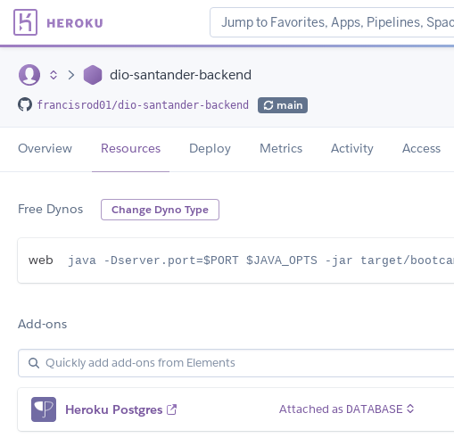
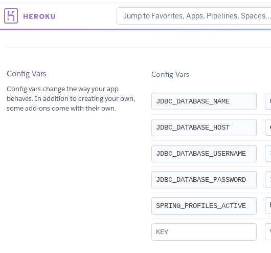
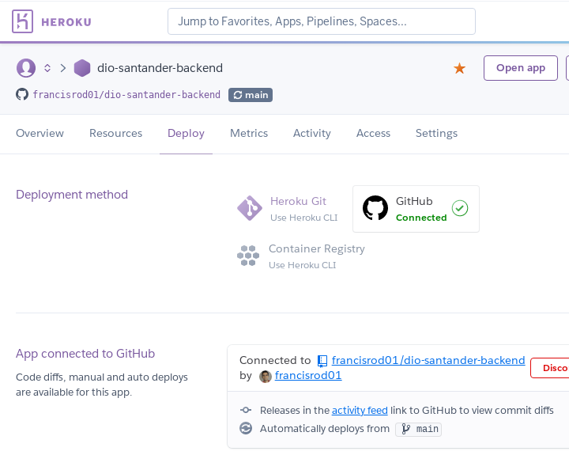

# dio-santander-backend

Backend for the Santander dev week

Author: [Francis Rodrigues](https://github.com/francisrod01)

#### Running on [heroku](https://dio-santander-backend.herokuapp.com/appsantander/swagger-ui.html)

## How to run the project

Before start running the project, you need to prepare your workspace environments:

- Set up the OpenJdk 16 in your pc
- Install the IntelliJ IDEA
- Install Docker in your Operating System
- Download and set up the PostgreSQL database

After that, start by running on a terminal:

```bash
~$ ./mvnw spring-boot:run
```

If everything goes right, you should see this output:

```bash
[INFO] Scanning for projects...
[INFO]
[INFO] ------------------------< com.project:bootcamp >------------------------
[INFO] Building bootcamp 0.0.1-SNAPSHOT
[INFO] --------------------------------[ jar ]---------------------------------
[INFO]
[INFO] >>> spring-boot-maven-plugin:2.5.0:run (default-cli) > test-compile @ bootcamp >>>
[INFO]
[INFO] --- maven-resources-plugin:3.2.0:resources (default-resources) @ bootcamp ---
[INFO] Using 'UTF-8' encoding to copy filtered resources.
[INFO] Using 'UTF-8' encoding to copy filtered properties files.
[INFO] Copying 1 resource
[INFO] Copying 0 resource
[INFO]
[INFO] --- maven-compiler-plugin:3.8.1:compile (default-compile) @ bootcamp ---
[INFO] Changes detected - recompiling the module!
[INFO] Compiling 1 source file to /home/paneladm/projects/dio-apps/santander-dev-week/dio-santander-backend/target/classes
[INFO]
[INFO] --- maven-resources-plugin:3.2.0:testResources (default-testResources) @ bootcamp ---
[INFO] Using 'UTF-8' encoding to copy filtered resources.
[INFO] Using 'UTF-8' encoding to copy filtered properties files.
[INFO] skip non existing resourceDirectory /home/paneladm/projects/dio-apps/santander-dev-week/dio-santander-backend/src/test/resources
[INFO]
[INFO] --- maven-compiler-plugin:3.8.1:testCompile (default-testCompile) @ bootcamp ---
[INFO] Changes detected - recompiling the module!
[INFO] Compiling 1 source file to /home/paneladm/projects/dio-apps/santander-dev-week/dio-santander-backend/target/test-classes
[INFO]
[INFO] <<< spring-boot-maven-plugin:2.5.0:run (default-cli) < test-compile @ bootcamp <<<
[INFO]
[INFO]
[INFO] --- spring-boot-maven-plugin:2.5.0:run (default-cli) @ bootcamp ---
[INFO] Attaching agents: []

  .   ____          _            __ _ _
 /\\ / ___'_ __ _ _(_)_ __  __ _ \ \ \ \
( ( )\___ | '_ | '_| | '_ \/ _` | \ \ \ \
 \\/  ___)| |_)| | | | | || (_| |  ) ) ) )
  '  |____| .__|_| |_|_| |_\__, | / / / /
 =========|_|==============|___/=/_/_/_/
 :: Spring Boot ::                (v2.5.0)

2021-05-29 05:47:44.698  INFO 1405040 --- [           main] c.project.bootcamp.BootcampApplication   : Starting BootcampApplication using Java 11.0.4 on debian with PID 1405040 (/home/paneladm/projects/dio-apps/santander-dev-week/dio-santander-backend/target/classes started by paneladm in /home/paneladm/projects/dio-apps/santander-dev-week/dio-santander-backend)
2021-05-29 05:47:44.700  INFO 1405040 --- [           main] c.project.bootcamp.BootcampApplication   : No active profile set, falling back to default profiles: default
2021-05-29 05:47:45.878  INFO 1405040 --- [           main] o.s.b.w.embedded.tomcat.TomcatWebServer  : Tomcat initialized with port(s): 8080 (http)
2021-05-29 05:47:45.975  INFO 1405040 --- [           main] o.apache.catalina.core.StandardService   : Starting service [Tomcat]
2021-05-29 05:47:45.976  INFO 1405040 --- [           main] org.apache.catalina.core.StandardEngine  : Starting Servlet engine: [Apache Tomcat/9.0.46]
2021-05-29 05:47:46.132  INFO 1405040 --- [           main] o.a.c.c.C.[Tomcat].[localhost].[/]       : Initializing Spring embedded WebApplicationContext
2021-05-29 05:47:46.132  INFO 1405040 --- [           main] w.s.c.ServletWebServerApplicationContext : Root WebApplicationContext: initialization completed in 1319 ms
2021-05-29 05:47:46.553  INFO 1405040 --- [           main] o.s.b.w.embedded.tomcat.TomcatWebServer  : Tomcat started on port(s): 8080 (http) with context path ''
2021-05-29 05:47:46.577  INFO 1405040 --- [           main] c.project.bootcamp.BootcampApplication   : Started BootcampApplication in 2.654 seconds (JVM running for 3.304)
2021-05-29 05:47:46.579  INFO 1405040 --- [           main] o.s.b.a.ApplicationAvailabilityBean      : Application availability state LivenessState changed to CORRECT
2021-05-29 05:47:46.581  INFO 1405040 --- [           main] o.s.b.a.ApplicationAvailabilityBean      : Application availability state ReadinessState changed to ACCEPTING_TRAFFIC
```
The server is now running on port 8080

## Set up the database using Docker

```bash
~$ docker run --name dio_postgresql -e POSTGRES_PASSWORD=dio_postgres -d -p 5432:5432 postgres
```
An explanation about the command above:

- `dio_postgresql` is the docker image name
- `-p:5432:5432` is mapping the image port to an external port
- `postgres` is the database user
- `dio_postgres` the database password

### Create the needed tables

```sql
CREATE TABLE public.tb_stock (
    id NUMERIC(9) NOT NULL,
    "date" date NOT NULL,
    "name" VARCHAR(100) NOT NULL,
    price NUMERIC(8,2) NOT NULL,
    variation NUMERIC(5,2) NOT NULL,
    CONSTRAINT tb_stock_pkey PRIMARY KEY (id)
);
```

Define `spring.datasource` and `spring.jpa` variables in the `application.yml` file:

```yml
spring:
  datasource:
    driver-class-name: org.postgresql.Driver
    url: jdbc:postgresql://localhost:5432/postgres
    username: postgres
    password: dio_postgres
  jpa:
    show-sql: true
    database-platform: org.hibernate.dialect.PostgreSQLDialect
    generate-ddl: false
    hibernate:
      ddl-auto: none
```

## Deploy on Heroku

### Creating a heroku app

https://dashboard.heroku.com/new-app

### Adding a Heroku Postgres

Access `https://dashboard.heroku.com/apps/<your app>/resources`.  
In the Add-ons section search for `Postgres` and select `Heroku Postgres`.



### Setting up config vars



### Setting up GitHub as Deployment

Here's how to set up GitHub as automatic deployment on heroku


